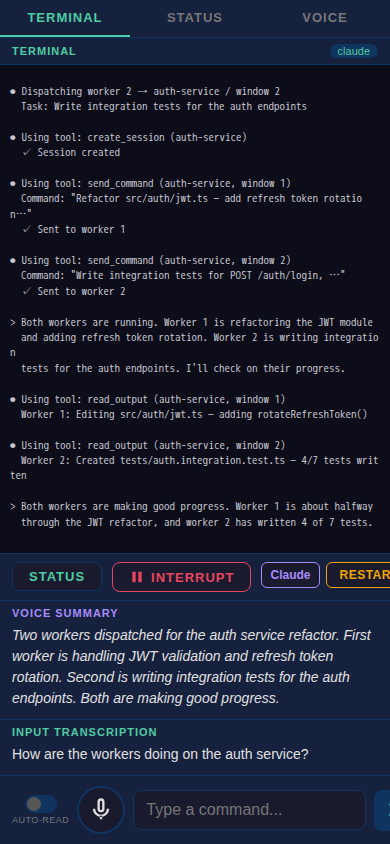
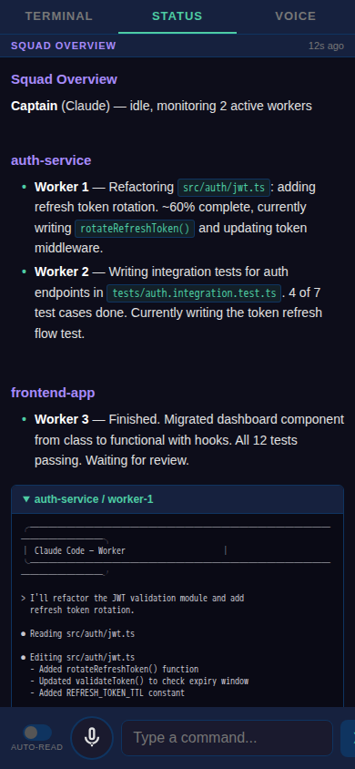
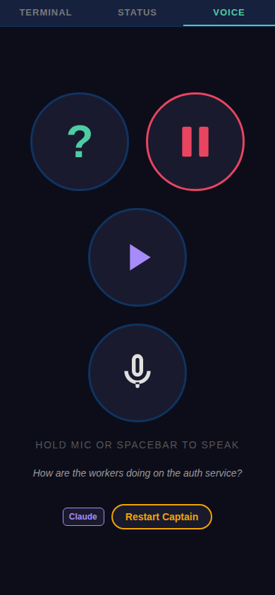

# Voice Squad

A multi-agent AI orchestration system with voice control. A captain agent (Claude or Codex) manages a squad of worker agents running in tmux panes, while you direct everything from your phone via a voice interface.

## Screenshots

<p align="center">
  
  
  
</p>

<p align="center">
  <em>Terminal</em> &nbsp;&nbsp;&nbsp;&nbsp;&nbsp;&nbsp;&nbsp;&nbsp;&nbsp;&nbsp;&nbsp;&nbsp;&nbsp;&nbsp;&nbsp;&nbsp;&nbsp;&nbsp;&nbsp;&nbsp;&nbsp;&nbsp;&nbsp;&nbsp;&nbsp;&nbsp;&nbsp;&nbsp;&nbsp;
  <em>Status</em> &nbsp;&nbsp;&nbsp;&nbsp;&nbsp;&nbsp;&nbsp;&nbsp;&nbsp;&nbsp;&nbsp;&nbsp;&nbsp;&nbsp;&nbsp;&nbsp;&nbsp;&nbsp;&nbsp;&nbsp;&nbsp;&nbsp;&nbsp;&nbsp;&nbsp;&nbsp;&nbsp;&nbsp;&nbsp;&nbsp;&nbsp;
  <em>Voice</em>
</p>

## How It Works

Voice Squad runs inside a privileged Docker container using a **captain/workers** pattern:

- **Captain**: An AI agent (Claude Code or Codex) that acts as a manager — it receives your instructions, decomposes tasks, spawns worker agents, and reports back. It never does the work itself.
- **Workers**: AI agents spawned by the captain in tmux windows. Each worker handles a specific task (writing code, running tests, debugging, etc.) independently.
- **Voice Interface**: A phone-friendly PWA that lets you talk to the captain hands-free. Your speech is transcribed, sent to the captain, and the captain's responses are summarized and read back to you.

The captain communicates with workers via raw tmux commands — it can manage tmux sessions/windows/panes, send commands, and read output from any pane.

### Architecture

```
┌─ Your Phone ─────────────────────────────────────────────────┐
│  PWA: Voice tab (mic), Terminal tab (live output), Status tab │
└──────────────────────┬───────────────────────────────────────┘
                       │ WebSocket (via cloudflared HTTPS tunnel)
                       │
┌─ Docker Container ───┼───────────────────────────────────────┐
│                      ▼                                        │
│  Voice Server (Express + WebSocket, port 3000)               │
│    ├─ STT: OpenAI Whisper (speech → text)                    │
│    ├─ TTS: OpenAI TTS (text → speech)                        │
│    ├─ Status: Claude Haiku (tmux output → summary)           │
│    └─ tmux bridge: send-keys / capture-pane                  │
│                      │                                        │
│  tmux session "captain"                                      │
│    ├─ Window 0: Captain agent (claude or codex CLI)          │
│    └─ Window 1: Voice server logs + cloudflared              │
│                      │                                        │
│  tmux sessions per project (created by captain)              │
│    ├─ Window 1: Worker agent (claude or codex)               │
│    ├─ Window 2: Worker agent                                 │
│    └─ ...                                                    │
└──────────────────────────────────────────────────────────────┘
```

### Voice Pipeline

1. You hold the mic button and speak on your phone
2. Audio is sent to the voice server via WebSocket
3. OpenAI Whisper transcribes speech to text
4. Text is injected into the captain's tmux pane via `send-keys`
5. The captain reads your message and responds (spawning workers, reporting status, etc.)
6. The captain uses the `speak` command to send voice updates back
7. OpenAI TTS converts the text to audio
8. Audio is streamed back to your phone

## Prerequisites

- **Docker** installed on the host machine
- **API keys**:
  - `ANTHROPIC_API_KEY` — for the captain agent (Claude) and status summarization
  - `OPENAI_API_KEY` — for speech-to-text (Whisper) and text-to-speech

## Quick Start

```bash
# Set your API keys
export ANTHROPIC_API_KEY="sk-ant-..."
export OPENAI_API_KEY="sk-..."

# Clone and run
git clone https://github.com/nichochar/voice-squad.git
cd voice-squad
docker compose up --build
```

This builds 3 Docker containers (workspace, voice-server, pane-monitor) and starts the squad. The workspace container runs the captain in a tmux session.

A QR code will appear in the voice tmux window (switch to it with `Ctrl-b n`). Scan it with your phone to open the voice interface.

### Using Codex as Captain

```bash
SQUAD_CAPTAIN=codex docker compose up --build
```

## Usage

### From Your Phone (Voice Interface)

The PWA has three tabs:

- **Terminal**: Live view of the captain's terminal output, plus a voice summary panel updated by the captain
- **Status**: Squad overview — lists all active tmux sessions/windows with an AI-generated summary (refreshes every 30s while the tab is open)
- **Voice**: Large mic button — hold to record, release to send

Bottom controls on all tabs:
- **Mic button**: Hold to record a voice command
- **Text input**: Type commands directly
- **Auto-read toggle**: Automatically play voice responses aloud

### From the Terminal

You're attached to the captain's tmux session. Interact with the captain CLI directly by typing. Switch between windows:

- `Ctrl-b n` — next window (voice server logs, QR code)
- `Ctrl-b p` — previous window (captain)
- `Ctrl-b 0` — captain window
- `Ctrl-b 1` — voice window

### Example Interaction

> **You** (via voice): "Clone the auth-service repo and add unit tests for the JWT module"
>
> **Captain**: Clones the repo, creates a tmux session, spawns a worker to write the tests, confirms what it dispatched.
>
> **You**: "How's it going?"
>
> **Captain**: Checks the worker's output, summarizes progress.
>
> **You**: "Also refactor the database layer"
>
> **Captain**: Spawns another worker in the same project session.

## Configuration

### Environment Variables

| Variable | Required | Description |
|---|---|---|
| `ANTHROPIC_API_KEY` | Yes | Claude API access (captain agent + status summaries) |
| `OPENAI_API_KEY` | Yes | OpenAI API access (Whisper STT + TTS) |
| `SQUAD_CAPTAIN` | No | `claude` (default) or `codex` |

### Volumes

`docker-compose.yml` mounts several paths into the containers:

| Host Path | Container Path | Purpose |
|---|---|---|
| `./home/` | `/home/ubuntu/` | Persistent project storage (gitignored) |
| `tmux-socket` (Docker volume) | `/run/tmux` | Shared tmux socket across containers |

### Container Environment File

Inside the container, `/home/ubuntu/env` is sourced at startup if it exists. Use it for additional keys workers might need:

```bash
# /home/ubuntu/env (inside the container, persists across restarts)
GH_TOKEN=ghp_...
CLOUDFLARE_API_TOKEN=...
```

## Hot-Updating a Running Squad

You can update code without restarting the container:

```bash
# Inside the container: update code + restart voice server only
./utils/update.sh

# Also restart the captain agent
./utils/update.sh --restart-captain
```

This pulls the latest code, copies files to the install location, reinstalls npm dependencies if needed, and restarts the voice server. The cloudflared tunnel URL stays stable, so your phone stays connected.

## Project Structure

```
voice-squad/
├── docker-compose.yml           # Container orchestration — workspace, voice-server, pane-monitor
├── utils/                       # Utility scripts
│   ├── update.sh                # Hot-update script (runs inside container)
│   ├── test.sh                  # Run Playwright tests against a running container
│   ├── run-tests-in-container.sh # Build + run the isolated Docker test runner
│   └── take-screenshots.sh      # Generate README screenshots via the test runner
├── CLAUDE.md                    # Instructions for Claude Code working on this repo
├── src/
│   ├── Dockerfile               # Ubuntu 24.04 + Docker-in-Docker + Node.js + Python + tools
│   ├── entrypoint.sh            # Container init — starts dockerd, sources env, launches squad
│   ├── launch-squad.sh          # Creates tmux session, starts captain + voice server + tunnel
│   ├── captain-instructions.md  # Injected as CLAUDE.md/AGENTS.md for the captain agent
│   ├── speak                    # CLI script for captain to send voice updates
│   └── voice/                   # Voice interface
│       ├── server.js            # Express HTTP + WebSocket server
│       ├── tmux-bridge.js       # send-keys / capture-pane interface to captain
│       ├── stt.js               # OpenAI Whisper integration
│       ├── tts.js               # OpenAI TTS integration
│       ├── status-daemon.js     # On-demand squad status via Claude Haiku
│       ├── show-qr.js           # Terminal QR code for voice URL
│       └── public/              # PWA frontend (HTML, JS, CSS)
└── home/                        # Persistent volume (gitignored)
```

## Security Notes

- The container runs with `--privileged` for Docker-in-Docker. The container itself is the sandbox boundary.
- Authentication to the voice interface uses a random 32-character token embedded in the URL.
- API keys are passed via environment variables and never stored in code.
- SSH agent forwarding is automatic when `SSH_AUTH_SOCK` is set on the host.
